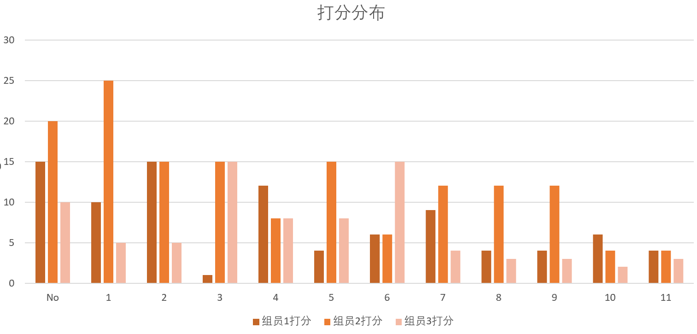
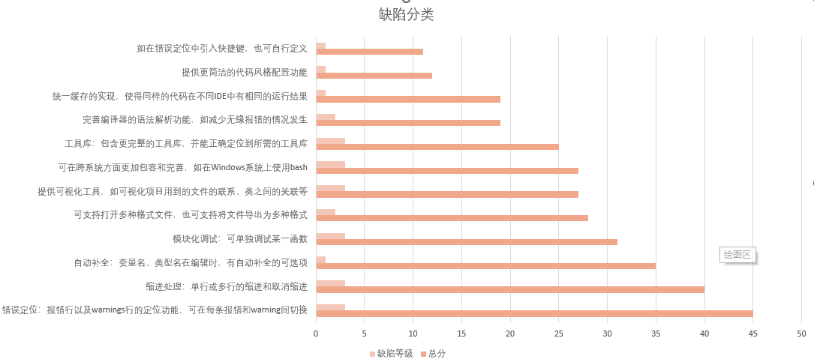

# 实验二：软件需求的优先级排序

小组成员：孔令迪 王珊 陈程

成绩分配比例： 33% 33 % 33%

实验仓库：https://github.com/Shannju/NJU-2022-Software-Requirements-Engineering

## 1. 实验目的

对软件需求进行优先级排序

## 2. 实验方法

通过对“IDE”标签对stackoverflow进行搜索，对大量的有关IDE的问答进行分析，从而获取潜在的需求。采用？？方法，对实验一的需求进行优先级排序。并且分析所提方法的排序效果。

## 3. 实验过程

### **3.1 数据获取**

>  我们从stack overflow中搜索关键词”ide”后得到许多网页，其中包括多种多样的问题和回答，但是鉴于本次实验的时间和机器内存等有限，且过于靠后的网页的问题和回答往往质量和数量不如排名靠前的网页高，所以采取爬取前50页的问答内容。
>
> 将每个问答作为一个需求，用kmeans算法对文本进行聚类并获得每个聚类中心，也即可代表属于同一类问答的一条问答。随后获取聚类中心问答中潜在的需求。
>
> ---实验一

从以上两种方法中，分析IDE可有如下需求：

#### （1）功能需求：

- 1.代码编辑

  - 1）自动补全：变量名、类型名在编辑时，有自动补全的可选项
  - 2）缩进处理：单行或多行的缩进和取消缩进

- 2. 调试

  - 1）模块化调试：可单独调试某一函数
  - 2）错误定位：报错行以及warnings行的定位功能，可在每条报错和warning间切换

- 3. 编译

  - 1）工具库：包含更完整的工具库，并能正确定位到所需的工具库
  - 2）完善编译器的语法解析功能，如减少无缘报错的情况发生
  - 3）统一缓存的实现，使得同样的代码在不同IDE中有相同的运行结果

- 4. 其他

  - 1）提供可视化工具，如可视化项目用到的文件的联系、类之间的关联等；
  - 2）提供更简洁的代码风格配置功能；

#### （2）非功能需求

- 1. 兼容性

  - 1）可在跨系统方面更加包容和完善，如在Windows系统上使用bash
  - 2）可支持打开多种格式文件，也可支持将文件导出为多种格式；

- 2. 快捷键

  - 如在错误定位中引入快捷键，也可自行定义

最终选取12条最具代表性的需求如下：

| 序号 | 需求内容                                                     |
| ---- | ------------------------------------------------------------ |
| 1    | 自动补全：变量名、类型名在编辑时，有自动补全的可选项         |
| 2    | 缩进处理：单行或多行的缩进和取消缩进                         |
| 3    | 模块化调试：可单独调试某一函数                               |
| 4    | 错误定位：报错行以及warnings行的定位功能，可在每条报错和warning间切换 |
| 5    | 工具库：包含更完整的工具库，并能正确定位到所需的工具库       |
| 6    | 完善编译器的语法解析功能，如减少无缘报错的情况发生           |
| 7    | 统一缓存的实现，使得同样的代码在不同IDE中有相同的运行结果    |
| 8    | 提供可视化工具，如可视化项目用到的文件的联系、类之间的关联等 |
| 9    | 提供更简洁的代码风格配置功能                                 |
| 10   | 可在跨系统方面更加包容和完善，如在Windows系统上使用bash      |
| 11   | 可支持打开多种格式文件，也可支持将文件导出为多种格式         |
| 12   | 快捷键：如在错误定位中引入快捷键，也可自行定义               |

### 3.2 需求排序

需求的优先级有以下几个视角：

- 用户的视角
- 技术实现的视角
- 项目管理的视角

从用户的视角来说，用户迫切需要的需求，就应该是优先级最高的需求。开发软件就是为了满足用户的需求，所以用户的角度应该排在这些视角当中的首位。

从技术实现的视角来说，有些需求和软件架构相关，这些需求就要优先实现；有些需求可能要采用新的平台、新的技术，这会带来技术风险，这些需求也要优先实现。

我们使用二者结合的方法，

- 先使用 “满意/不满意模型”又称（KANO模型）通过调查问卷形式获得用户的满意度。
- 再由技术人员结合技术实现的难度来评定缺陷等级。

### 3.3 模型简介

“满意/不满意模型”示例如下：

对每一条需求都用满意度和不满意度两个量化指标来打分，最终将两个指标的分值相乘，按分值的高低进行排序。

其中满意度是指当需求实现后，用户的满意程度，量化指标分为：

非常满意（5分）、比较满意（4分）、满意（3分）、一般（2分）、无所谓（1分）；

不满意度是指当需求没有实现时，用户不满意的程度，量化指标分为：

非常不满意（5分）、比较不满意（4分）、不满意（3分）、一般（2分）、无所谓（1分）。

假设有个应用程序，有“单键复制”需求项，采用满意/不满意模型方法打分表如下：

| 需求项       | 评价项   | 评价结果                                      |
| ------------ | -------- | --------------------------------------------- |
| 单键复制功能 | 满意度   | 非常满意、比较满意√、满意、一般、无所谓       |
|              | 不满意度 | 非常不满意、比较不满意、不满意√、一般、无所谓 |
|              | 总评价   | 4分×3分=12分                                  |

## 4. 结果分析

### 实验结果

| No   | 需求                                                         | 组员1打分 | 组员2打分 | 组员3打分 | 总分 | 缺陷等级 |
| ---- | ------------------------------------------------------------ | --------- | --------- | --------- | ---- | -------- |
| 1    | 错误定位：报错行以及warnings行的定位功能，可在每条报错和warning间切换 | 3*5=15    | 5*4=20    | 5*2=10    | 45   | 3        |
| 2    | 缩进处理：单行或多行的缩进和取消缩进                         | 2*5=10    | 5*5=25    | 5*1=5     | 40   | 3        |
| 3    | 自动补全：变量名、类型名在编辑时，有自动补全的可选项         | 3*5=15    | 5*3=15    | 5*1=5     | 35   | 1        |
| 4    | 模块化调试：可单独调试某一函数                               | 1*1=1     | 5*3=15    | 5*3=15    | 31   | 3        |
| 5    | 可支持打开多种格式文件，也可支持将文件导出为多种格式         | 4*3=12    | 4*2=8     | 4*2=8     | 28   | 2        |
| 6    | 提供可视化工具，如可视化项目用到的文件的联系、类之间的关联等 | 2*2=4     | 5*3=15    | 4*2=8     | 27   | 3        |
| 7    | 可在跨系统方面更加包容和完善，如在Windows系统上使用bash      | 2*3=6     | 3*2=6     | 5*3=15    | 27   | 3        |
| 8    | 工具库：包含更完整的工具库，并能正确定位到所需的工具库       | 3*3=9     | 3*4=12    | 4*1=4     | 25   | 3        |
| 9    | 完善编译器的语法解析功能，如减少无缘报错的情况发生           | 2*2=4     | 4*3=12    | 3*1=3     | 19   | 2        |
| 10   | 统一缓存的实现，使得同样的代码在不同IDE中有相同的运行结果    | 2*2=4     | 3*4=12    | 3*1=3     | 19   | 1        |
| 11   | 提供更简洁的代码风格配置功能                                 | 3*2=6     | 4*1=4     | 2*1=2     | 12   | 1        |
| 12   | 如在错误定位中引入快捷键，也可自行定义                       | 2*2=4     | 4*1=4     | 3*1=3     | 11   | 1        |

可以看出，打分较为均匀

### 效果分析

结合调查结果，为缺陷定义等级

我们根据缺陷等级的定义，将所有的缺陷分为4类：

轻微缺陷（1）、一般缺陷（2）、严重缺陷（3）、致命缺陷（4）

- **轻微缺陷**：是指对产品外观和下道工序可能会有轻微影响的缺陷
- **一般缺陷**：是指不影响产品的运转和运行、不会成为故障起因，但对产品外观和下道工序影响较大的缺陷
- **严重缺陷**：是指可以引起易于纠正的异常情况、可能引起易于修复的故障或对产品外观造成难以接受的缺陷
- **致命缺陷**：是指会造成安全问题的各类缺陷

由上述表格可以知道：

1. 不存在致命缺陷

2. 应用我们的排序方法得到的打分结果的前几位，也就是我们最需要的需求，它们都是属于严重缺陷，

   - 由此可见应用我们的排序方法得到的比较迫切的需求，基本上都是属于严重缺陷或一般缺陷
   - 也就是说我们的排序方法可以突出比较严重的缺陷

3. 且应用我们的排序方法得到的打分结果的后几位，也就是我们最不需要的需求，它们都是属于轻微缺陷

   - 所以我们的排序方法也可以弱化比较轻微的缺陷

4. 但是应用我们的排序方法对于不那么迫切，但是也有一些重要的需求，则不太能取分出它们的等级来，当然这也和我们的数据量较小有一定的关系

   

总的来看，我们的排序方法可以较好地突出较为迫切地需要、体现较为严重的缺陷，并且在资源有限的前提下也可以排除一些不甚重要的需要改进的地方，可以帮助决策者和开发人员参考得到当前较为重要的开发需求、开发任务。

